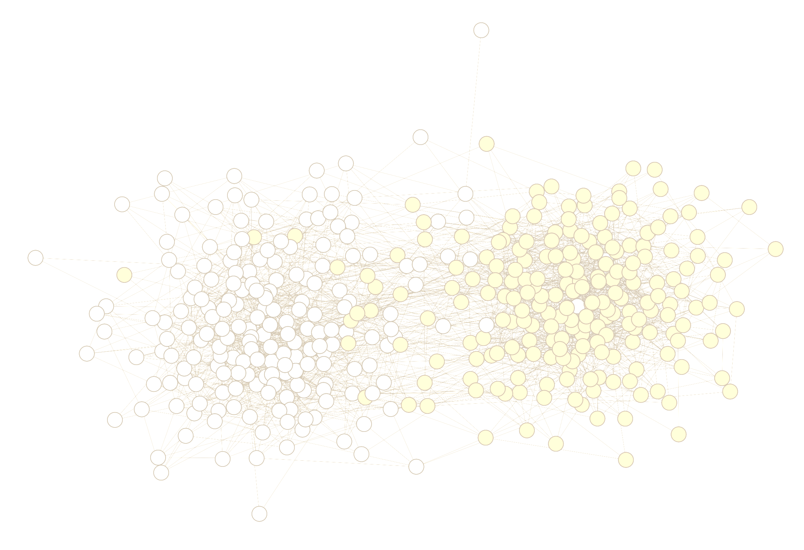

```{r child = "style/rmd/DJN_setup.Rmd"}
```

---


# This is a plain slide. 

Here is some content on the slide. 

.pull-left[
This got pulled left.
]

.pull-right[
This got pulled right. 
]

---

# This slide has a scaled image on it. 



---

class: left, middle
background-image: url(img/network_sample_blur.png)

## this slide has a background. 

---

background-color: #F5B895

# This slide has a solid color background

Also a footnote. 

.footnote[footnote content test]

---

class: left, inverse

# This slide uses the inverse class. 

Here's some stuff. 

